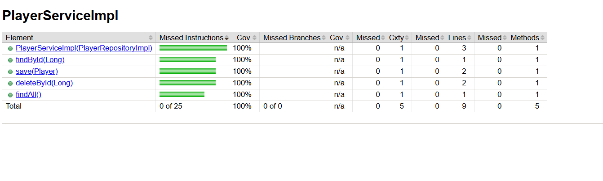
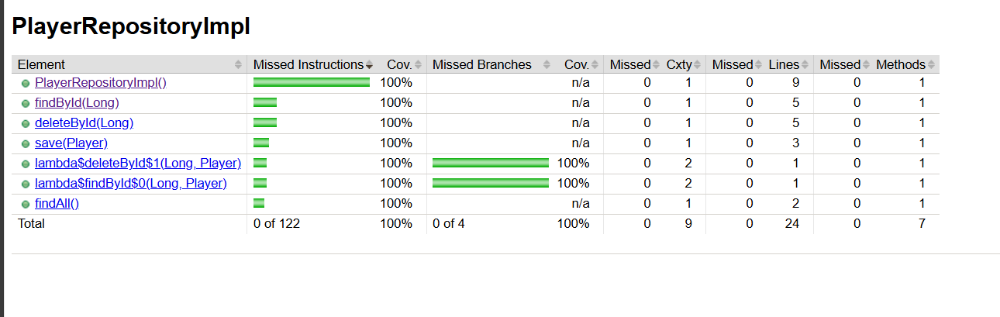

# Proyecto de Pruebas Unitarias con Mockito


Este proyecto es un ejercicio práctico para implementar pruebas unitarias utilizando Mockito y JUnit 5 en una aplicación que simula la gestión jugadores.

## Configuración del Proyecto

- Java 21
- JUnit 5 para pruebas
- Mockito para mocking
- JaCoCo para cobertura de código (configuración mínima del 95%)

##  Estructura del Proyecto
```
src/
├── main/
│   ├── java/org/mock/
│   │   ├── repository/
│   │   │   ├── PlayerRepositoryImpl.java
│   │   │   └── IplayerRepository.java (interfaz implícita)
│   │   ├── service/
│   │   │   ├── PlayerServiceImpl.java
│   │   │   └── IPlayerService.java (interfaz implícita)
│   │   └── persistence/entity/
│   │       └── Player.java (clase de entidad)
│   └── resources/
└── test/
├── java/org/mock/
│   ├── repository/
│   │   └── PlayerRepositoryTest.java
│   ├── service/
│   │   └── PlayerServiceTest.java
│   └── DataProvider.java
└── resources/
```
## Pruebas Unitarias

### PlayerRepositoryTest
Pruebas de integración para el repositorio real:
- Verifica el correcto funcionamiento de todas las operaciones CRUD
- Incluye pruebas para casos de error (jugador no encontrado)

### PlayerServiceTest
Pruebas unitarias con Mockito para el servicio:
- Utiliza mock del repositorio para aislar las pruebas
- Verifica el comportamiento del servicio y las interacciones con el repositorio
- Incluye uso de ArgumentCaptor para verificar parámetros

### DataProvider
- Clase de utilidad que proporciona datos de prueba mockeados para las pruebas.

## Resultados 





##  Cómo ejecutar

1. Clonar el repositorio
2. Ejecutar pruebas y generar reporte Jacoco:
   ```bash
   mvn clean test

## Créditos

Este proyecto está basado en el ejercicio mostrado en el canal [Un Programador Nace](https://youtube.com/@unprogramadornace).  
Gracias al creador por compartir contenido educativo de calidad.
Todo el crédito por la lógica original pertenece a su autor.